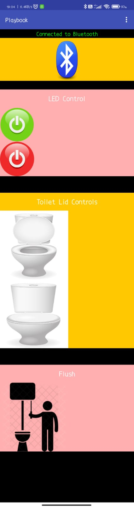

# An Android App for Smart Bathroom Control

This repository contains the Android app code for the Playbook project, which was developed as part of an IoT course's final project. The goal of the project was to create a Smart Bathroom environment where users can control various features such as lights, doors, flush, and seat movements using a mobile app. The app was created using MIT App Inventor's codebase and offers a simple and intuitive user interface design. The Arduino code used in conjunction with this app is not included in this repository.

## Contents

- `Playbook`: This directory contains the code for the Android app. It includes the necessary files and resources to build and run the app.

## Project Description

The project aims to create a Smart Bathroom environment that provides convenient control over various features. The app serves as the interface for users to interact with the Smart Bathroom system. The team members, Anush, Mukta, Ronak, and Sriya, collaborated to design and implement the project. The app was developed using MIT App Inventor, which simplifies the process of creating Android apps with a visual programming interface.

The Smart Bathroom system integrates Arduino-based hardware, including sensors such as ultrasonic sensor and water level sensor, along with the ESP32 module. The Arduino code, which interacts with the hardware components, is not included in this repository.

## Feedback and Contributions

If you have any questions regarding the project, please feel free to contact any of the team members:

- Anush Anand
  - GitHub: [anush](https://github.com/Anush2004)

- Mukta Chanda
  - GitHub: [mukta](https://github.com/muktachanda)

- Ronak Dhingra 
  - GitHub: [ronak](https://github.com/Ronak-Dhingra)

- Sriya Venepally
  - GitHub: [sriya](https://github.com/sriyav17)
  
We will be glad to assist you.
